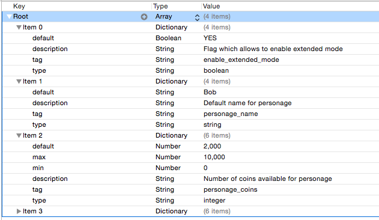

# Upsight iOS SDK

####Manual Integration
To start with, you need the UpsightKit framework stored on your machine

1. Add the UpsightKit framework to your app in the Build Phases section of the target settings. Also add the CoreTelephony and AdSupport frameworks provided by Apple.
1. In the Info section the target properties, add UpsightAppToken and UpsightAppSecret. These are of type `string` and were provided on the Upsight dashboard when you added your app.
1. In the Build Settings section of the target, add -ObjC to the Other Linker Flags field.

#####Xcode Documentation
The Upsight iOS SDK uses appledoc to generate visually appealing API method documentation in the form of HTML.
These docs are fully indexed and browsable through Xcode.

When doing manual integration of the UpsightKit framework, you can optionally install the Upsight documentation so that it is available in Xcode. In order to do that, extract the [iOS SDK zip file](https://help.upsight.com/api-sdk-reference/downloads/) and run the following commands:

    $ ./install_docsets.sh

Note: Installing the Upsight documentation will fail if you have not installed any documentation yet. If the installation process fails, navigate to the Downloads section of Xcode settings and download any other documentation modules. Then run the script again.

To see the Upsight Documentation, click Help > Documentation and API Reference. On the left hand side, you will find the UpsightKit Documentation.

####CocoaPods Integration
Using [CocoaPods](https://guides.cocoapods.org) is the easiest way to integrate the SDK into your project. Simply add `pod 'UpsightKit'` to your `Podfile`. Here is an example of a Podfile with two targets, for iOS and tvOS apps:

    target 'MyiOSApp' do
        platform :ios, '8.0'
        pod 'UpsightKit', '~> 4.0.5'
    end

    target 'MyTvOSApp' do
        platform :tvos, '9.1'
        pod 'UpsightKit', '~> 4.0.5'
    end

####Debugging
To start with, turn on full debug logging:

1. Add `#import <UpsightKit/UpsightKit.h` at the top of your AppDelegate.m file.
1. In `application:didFinishLoadingWithOptions:` add `[Upsight setDefaultLogLevel:UpsightLoggerLevelDebug];` This will let you see the SDK's debug output while you confirm the integration. Once you're finished the integration, you can remove this line.

If you run the app now, you’ll see debug output showing SDK activity in XCode's debug console.

At this point:

* Running the app will generate an "upsight.config.expired" message.
* The server will send a response to this message. The response body defines the configuration for the SDK. You will see the response JSON in the debug console.

Sessions are being tracked, and session-based metrics will be available:

* Starting the app will generate an "upsight.session.start" message.
* Stowing the app will generate an "upsight.session.pause” message.
* When the app returns to the foreground an "upsight.session.resume" message is generated if you have been in the background for less than the configured session gap time (set by the server). Otherwise, a new "upsight.session.start" is sent, and the session ID is updated.
* These messages are batched and sent together: they will not show up on the dashboard immediately. You'll see a message like this in the debug window when the batch of events are sent: "batch queue sending batch to endpoint: http://batch.upsight-api.com/batch/v1/"

####Custom Events
To add a custom event:

1. In your main view controller’s .m file, add `#import <UpsightKit/UpsightKit.h>`
1. At the point where you want to emit the event, add 

`[Upsight recordAnalyticsEventWithName:@"myApp.myEvent.name" properties:nil];`

The debug console will now show the event has been stored. Note that until a sufficient number of events has been accumulated, or the batch of messages has reached a certain age, the messages will not actually be transmitted to the server.

#### Location
Enabling location tracking will allow you target and segment your users based on their geographical location. That data will be attached to all the events sent from the device. To provide the SDK with location data, first configure location services in your application.

	CLLocationManager *locationManager = [[CLLocationManager alloc] init];
	locationManager.delegate = self; // something that implements CLLocationManagerDelegate
	locationManager.desiredAccuracy = kCLLocationAccuracyBest;
	locationManager.distanceFilter = 1.0;
    if ([self.locationManager respondsToSelector:@selector(requestWhenInUseAuthorization)]) {
        [self.locationManager requestWhenInUseAuthorization];
    }
    [locationManager startUpdatingLocation];

Then implement the following `CLLocationManagerDelegate` method.

	- (void)locationManager:(CLLocationManager *)manager didUpdateLocations:(NSArray *)locations
	{
	    CLLocation *location = [locations firstObject];
	    [Upsight setLocation:location];
	}

Finally, add a row to your application's info.plist file with the `NSLocationWhenInUseUsageDescription` key, and set the value to the text you want the application to display to users when they're asked for permission to use their location data.

The location you provide to the SDK will be used until it is updated, or until the user's session ends (the application is put into the background for more than two minutes, or is brought from the background by a push notification).
 
It is good practice to have only one instance of CLLocationManager active at a time. When an instance of CLLocationManager goes out of scope you will cease to receive location updates, it is typically saved as a property in an active object instance.

It is also good practice to set the `desiredAccuracy` to the lowest value possible while still achieving your application's purpose. This is to prevent excessive use of system resources.

#### User Attributes
User Attributes are properties you define which appear on every event sent to the Upsight servers. You must first define the attributes in the Info section of your project's settings.
	
1. Add a new row to your project's Info list and name it `UpsightUserAttributes`
1. Set the new row's type to `Dictionary`
2. Click on the disclosure triangle to the left of `UpsightUserAttributes`
3. Add a new row for each of the User Attributes you want to include, providing a name, type, and default value for each

Within your code you can retrieve and set values for the User Attributes you have created. You access them by name. Assuming you used the preceeding steps to create two attributes called "myNumberAttribute" and "myStringAttribute" with type Number and String respectively, you would retrieve their values with the following:

	NSNumber *aNumber = [USUserAttributes numberForKey:@"myNumberAttribute"];
	NSString *aString = [USUserAttributes stringForKey:@"myStringAttribute"];
	NSString *aDate = [USUserAttributes dateForKey:@"myDateAttribute"];
	BOOL aBool = [USUserAttributes boolForKey:@"myBooleanAttribute"];	
	
This returns the default values as defined in the Info settings, unless you change the values, like this:

	[USUserAttributes setNumber:@(10) forKey:@"myNumberAttribute"];
	[USUserAttributes setString:@"aString" forKey:@"myStringAttribute"];
	[USUserAttributes setDate:[NSDate date] forKey:@"myDateAttribute"];
	[USUserAttributes setBool:NO forKey:@"myBooleanAttribute"];
	
Now, `NSNumber *aNumber = [USUserAttributes numberForKey:@"myNumberAttribute"];` will return 10, `NSString *aString = [USUserAttributes stringForKey:@"myStringAttribute"];` will return aString, `[USUserAttributes dateForKey:@"myDateAttribute"]` will return the date and time when the `setDate:forKey:` method was called, and `BOOL aBool = [USUserAttributes boolForKey:@"myBooleanAttribute"]` will return NO.

Note that you cannot programmatically add or remove User Attributes. They must be added and removed through the Info settings. Adding and removing User Attributes will cause a discontinuity in the data stored on Upsight's servers, so it is something you should do only with forethought and planning.

####Milestones
Milestones should be triggered when your user reaches a point in your application that you want to track or on which you want to take action. 

Milestones have one required property - a "Scope" that uniquely describes that location in your application. 
Examples of __Scope__ are "main_menu", "inventory", or "level_up"

`[Upsight recordMilestoneEventForScope:@"main_menu"];`

####Showing Content
The SDK receives content from the server in response to events. By default, Milestone events will return content. In the future, publishers will be able to configure any event to return content.

Displaying marketing content requires a 'Billboard.' A billboard is like an empty frame into which the SDK can place content it receives from the server. Like milestone events, each billboard is associated with a __Scope__. The content returned after a Milestone event will have the same __Scope__ as the Milestone.

There are three basic steps to show content:

2. Add the USBillboardDelegate protocol to one of your class and implement `presentingViewControllerForBillboard:`
3. Get the USBillboard object for the scope in which you want to show content, and set its delegate property to point at an object of the class from step 1.
1. Record a Milestone event for the scope.

By changing when your code performs steps 2. and 3. you can control when the content will be shown. Steps 2. and 3. do not need to be performed in a particular order, and content won't be shown until both steps have been performed.

######Example 1: Showing a Billboard in a View Controller
Change the ViewController’s interface definition to indicate that it implements `USBillboardDelegate`. This requires a `<USBillboardDelegate>` at the end of the View Controler’s `@interface` directive at the top of the .m file:

	@interface ViewController () <USBillboardDelegate>

Add the following method:

	-(UIViewController *)presentingViewControllerForBillboard:(id<USBillboard>)aBillboard
	{
		return self;
	}

In the View Controller’s `viewDidLoad:` method get the USBillboard for your scope:

	id <USBillboard> billboard = [Upsight billboardForScope:@“<your scope name>”];  
	billboard.delegate = self;

Finally, send the Milestone:

	[Upsight recordMilestoneEventForScope:@“<your scope name>”];  

######Example 2: Showing a Billboard in a Custom Class

In this example, content will be shown whenever MyClass's anInterestingMethod is called

	@implementation MyClass
	
	- (instancetype)init
	{
	    self = [super init];
	    if (nil != self) {
	        
	        // Get the billboard for the scope
	        id<USBillboard> billboard = [Upsight billboardForScope:@"SomethingInteresting"];
	        
	        // Set this object as the billboard's delegate
	        // so the billboard can call presentingViewControllerForBillboard:
	        billboard.delegate = self;
	    }
	    return self;
	}
	
	
	- (void)anInterestingMethod
	{
	    // Send a Milestone event here because something intersting happened
	    [Upsight recordMilestoneEventForScope:@"SomethingInteresting"];
	}
	
	
	#pragma mark USBillboardDelegate methods
	
	- (UIViewController *)presentingViewControllerForBillboard:(id<USBillboard>)aBillboard
	{
	    UIViewController *topController = [UIApplication sharedApplication].keyWindow.rootViewController;
	    
	    while (topController.presentedViewController) {
	        topController = topController.presentedViewController;
	    }
	    
	    return topController;
	}
	
	@end

**Note:** When you no longer want content to appear for a given billboard, you should set its delegate back to nil;

If you want to check if there is any content ready for a given scope, call the `isContentReady` method on the billboard for that scope.

    if (YES == [Upsight billboardForScope:self.currentScope].isContentReady) {
        // Take action
    }

#### Reacting to Virtual Goods Promotions and Rewards
Rewards and Virtual Goods Promotions (VGP) are two types of content you can set up through the dashboard and display in a billboard. These are different from other content units in that you, as a programmer, need to know whether or not the customer acepted the offer.

In the event your user receives a reward or agrees to puchase a virtual good you are notified through one of two optional methods of the billboard delegate protocol:

	- (void)billboard:(id<USBillboard>)aBillboard didReceiveReward:(id<USReward>)aReward;
	- (void)billboard:(id<USBillboard>)aBillboard didReceivePurchase:(id<USPurchase>)aPurchase;

By providing an implementation for one or both of these methods your code is given the opportunity to take appropriate action based on what your user has done.

In the case of a VGP, it is likely you will need to broker a transaction between your user and Apple's App Store. Once that transaction is finished you can track the results using an InAppPurchase event.

####Tracking Monetization
There are two separate events that track monetization. If you wish to track a purchase made through the App Store, use the following method from the Upsight class:

	+ (void)recordInAppPurchaseEventWithResolution:(USPurchaseResolution)resolution
	                                       product:(NSString *)product
	                                      quantity:(NSUInteger)quantity
	                                         price:(float)price
	                                      currency:(NSString *)currency;
                                      
*resolution* - one of 

* `USPurchaseResolutionBuy`if the purchase was successful
* `USPurchaseResolutionCancel` if the user canceled the purchase
* `USPurchaseResolutionFraud` if you have detected this is a fraudulent purchase
* `USPurchaseResolutionRefund` if you are refunding the purchase

*product* - The product name, as provided by the productIdentifier property of an SKProduct object  
*quantity* - The number of products purchased during the transaction, as set in the quantity property of an SKPayment object  
*price* - the value returned by `price.floatValue` where `price` is the price property of an SKProduct object  
*currency* - the value returned by `[priceLocale objectForKey:NSLocaleCurrencyCode]` where `priceLocale` is the priceLocale of an SKProduct object

When the SDK sends an InAppPurchase event recorded with this method, it attaches the receipt object from the transaction with the App Store; the Upsight server validates this receipt with the Apple servers.

If you have a purchase to record that did not involve the Apple store, you can use this method instead:

	+ (void)recordMonetizationEventWithTotalPrice:(float)totalPrice currency:(NSString *)currency;

*totalPrice* - the total amount of the transaction  
*currency* - typically retrieved using `[[NSLocale currentLocale] objectForKey:NSLocaleCurrencyCode]`

#### Push
Push is supported through the USPush interface. Pushed content is displayed through a Push-specific billboard which is managed by the USPush interface. To integrate push, you must:

1. Add the USBillboardDelegate protocol to your App Delegate and implement `presentingViewControllerForBillboard:`
1. Register for push by calling `[USPush registerForPushNotifications]` in your App Delegate's `didFinishLaunchingWithOptions:` method.
1. Call the USPush API method `didRegisterUserNotificationSettings:` in your App Delegate's `application:didRegisterUserNotificationSettings:` method.
1. Call the USPush API method `registerPushToken:` from `didRegisterForRemoteNotificationsWithDeviceToken:`
1. When a remote notification is received, set the USPush billboard's delegate to be your App Delegate class and call the USPush interface's `handleRemoteNotificationWithUserInfo:` method.
1. If you plan to start downloading content when a push notification arrives, which is referred to as "silent" push notifications, check 'Remote notifications' from the list of Background Modes in the Capabilities section of your target's settings.

Here is a sample AppDelegate implementation that properly integrates Push

	@interface AppDelegate () <USBillboardDelegate>
	@end
	
	@implementation AppDelegate	
	
	- (BOOL)application:(UIApplication *)application didFinishLaunchingWithOptions:(NSDictionary *)launchOptions {
	    [Upsight setDefaultLogLevel:UpsightLoggerLevelDebug];
	
	    // Override point for customization after application launch.
	    [USPush registerForPushNotifications];
	    
	    return YES;
	}
	
	- (void)application:(UIApplication *)application didRegisterUserNotificationSettings:(UIUserNotificationSettings *)notificationSettings
	{
	    [USPush didRegisterUserNotificationSettings:notificationSettings];
	}
	
	- (void)application:(UIApplication *)application didRegisterForRemoteNotificationsWithDeviceToken:(NSData *)deviceToken
	{
	    [USPush registerPushToken:deviceToken];
	}
	
	- (void)application:(UIApplication *)application didReceiveRemoteNotification:(NSDictionary *)userInfo fetchCompletionHandler:(void (^)(UIBackgroundFetchResult))completionHandler
	{
	    [USPush pushBillboard].delegate = self;
	    [USPush handleRemoteNotificationWithUserInfo:userInfo];

        if (NULL != completionHandler) {
            completionHandler(UIBackgroundFetchResultNoData);
        }
	}
	
	- (void)applicationWillResignActive:(UIApplication *)application {
	    // Sent when the application is about to move from active to inactive state. This can occur for certain types of temporary interruptions (such as an incoming phone call or SMS message) or when the user quits the application and it begins the transition to the background state.
	    // Use this method to pause ongoing tasks, disable timers, and throttle down OpenGL ES frame rates. Games should use this method to pause the game.
	}
	
	- (void)applicationDidEnterBackground:(UIApplication *)application {
	    // Use this method to release shared resources, save user data, invalidate timers, and store enough application state information to restore your application to its current state in case it is terminated later.
	    // If your application supports background execution, this method is called instead of applicationWillTerminate: when the user quits.
	}
	
	- (void)applicationWillEnterForeground:(UIApplication *)application {
	    // Called as part of the transition from the background to the inactive state; here you can undo many of the changes made on entering the background.
	}
	
	- (void)applicationDidBecomeActive:(UIApplication *)application {
	    // Restart any tasks that were paused (or not yet started) while the application was inactive. If the application was previously in the background, optionally refresh the user interface.
	}
	
	- (void)applicationWillTerminate:(UIApplication *)application {
	    // Called when the application is about to terminate. Save data if appropriate. See also applicationDidEnterBackground:.
	}
	
	#pragma mark - Billboard delegate
	
	- (UIViewController *)presentingViewControllerForBillboard:(id<USBillboard>)aBillboard
	{
	    UIViewController *topController = [UIApplication sharedApplication].keyWindow.rootViewController;
	    
	    while (topController.presentedViewController) {
	        topController = topController.presentedViewController;
	    }
	    
	    return topController;
	}
	
	@end

#### Managed Variables

This feature allows you to use Managed Variables in your application; these are variables whose values are set by the server. Managed Variables are referenced by tag.

To begin with you must declare your Managed Variables in a file called UpsightUXMVariables.plist

The default field should contain the value the Managed Variable should return if it has not been updated by the server.
The description field should contain a `string` that describes what the Managed Variable is used for.
The type field should define the type of the Managed Variable. Variables can be of type `string`, `integer`, `float`, or `boolean`.
The tag field defines the name by which you will reference the variable in your code. Each tag must be unique within your app.
The max field is only used by number type variables. It defines the largest number value that the Managed Variable can return; any larger values will be replaced by this value.
The min field is only used by number type variables. It defines the smallest number value that the Managed Variable can return; any smaller values will be replaced by this value.

In the source file where you want to access a managed variable, import the Upsight framework.

    #import <UpsightKit/UpsightKit.h>

Then, call the USManagedVariable class method listed below that corresponds to the type of the managed variable you are accessing.

    + (id<USManagedString>)managedStringWithTag:(NSString *)aTag;
    + (id<USManagedInteger>)managedIntegerWithTag:(NSString *)aTag;
    + (id<USManagedFloat>)managedFloatWithTag:(NSString *)aTag;
    + (id<USManagedBoolean>)managedBooleanWithTag:(NSString *)aTag;

The returned object will have a `value` method appropriate to its type. The `value` method returns the most recent value retrieved from the server, or the default value if no value has been retrieved yet.

    id<USManagedString> uxmString = [USManagedVariable managedStringWithTag:@"personage_name"];
    NSLog(@"The current value of personage_name is %@", uxmString.stringValue);

If you wish to be notified when the system has updated the values of the Managed Variables, you can set a delegate on the variable observer:

    [Upsight variableObserver].delegate = self;

The object you assign as the variableObserver's delegate must conform to the `USManagedVariableObserverDelegate` protocol. This call must be made no earlier than the call to your app delegate's `applicationDidBecomeActive:` method.

If you implement the optional `observer:didSynchronizeManagedVariables:` method, the Managed Variable observer will call your implementation immediately after all the managed variables have been updated. Included in this call is an `NSArray` containing the tags of all the variables that were updated.

If you keep any references to Managed Variables that you access before the call to `observer:didSynchronizeManagedVariables:` you need to refresh those references afterward in order to see the new values.

If you wish to prevent updates to the Managed Variables you can override `observerShouldSynchronizeManagedVariables:`. If you return `NO` from your implementation of this method none of the managed variables will be updated. This method is called every time a session starts, so you will have the chance to accept updates you previously rejected.

#### SDK Size
The Upsight SDK increases the size of what you'll submit to iTunesConnect by 450 KB. Adding the Mediation SDK will increase the size of an app by at most 3.1 MB. The impact will be reduced if your app already links against some or all of the frameworks the Mediation SDK depends on.

Measurements were made by exporting ipa files from Xcode 7.2 using the "Prepare for upload to App Store" and comparing their size in Finder.

| App | Base Size | With Platform | With Mediation |
| --- | --------- | ------------- | -------------- | 
| Test App 1 | 62 KB | 514 KB | 3.1 MB |
| Test App 2 | 146 KB | 596 KB | 3.2 MB | 